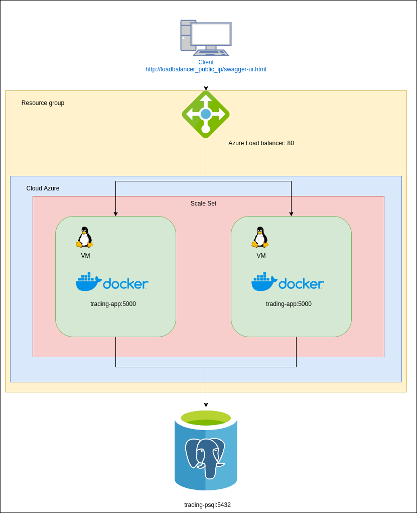
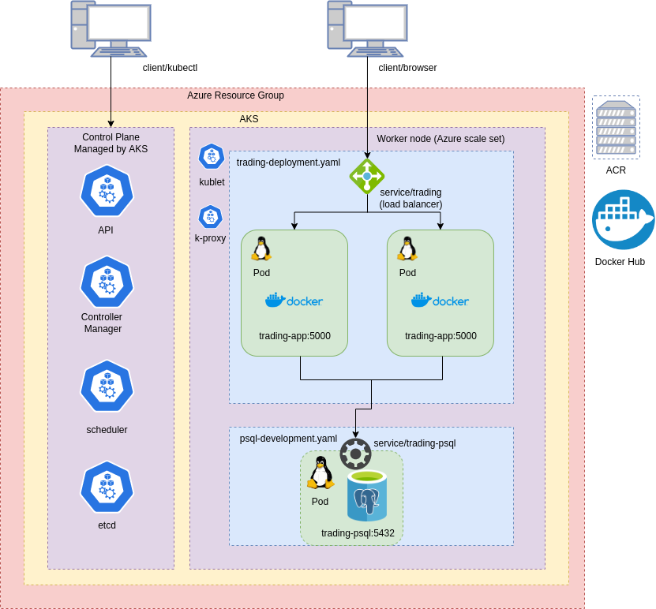
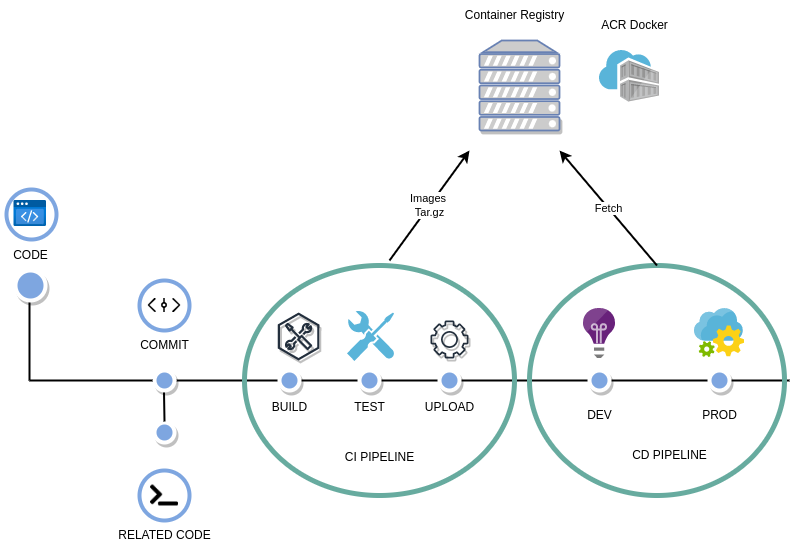

# Introduction
This project was kicked off to migrate spring boot application's resources to cloud using Microsoft Azure. The migration of the resources to cloud would allow the team to not having to buy a hardware to establish a server. The team only needs to pay for as much as needed to run the application. Furthermore, horizontal and vertical scaling can be done online. This provides the company huge benefit for the performance of the applicaiton and lower the financial costs to run the app.

The resources acquired through Azure include, load balancers, application servers which are flexible to be scaled both horizontally and vertically, and a Postgres database server. On top of manually establishing the resources, we also deployed the application using kubenetes. Separate pods for application and database server was established and the load balancer responsible for communication with external clients. 

Fianlly, we implemented Jenkins to establish CI/CD pipelines. Through Jenkisfile written in groovy, build, testing, and deployment has been automated. Build includes establishing docker containers and running the application in them. Test ensures the application has the correct functionality. 

# Application Architecture

# Kubernetes Architecture

# Jenkins CI/CD pipeline
- `Build` - Docker file builds an image out of the code pushed makes a runnable application
- `Test` - Unit tests testing the functionality of application
- `Deploy` - The image of running application is deployed on server so that users can use it. 
- `DEV` - Development environment
- `UAT` - User Acceptance Testing Environment
- `PROD` - Production environment

# Improvements
 - Add a automatic checking for code quality. It could be added to the CI/CD pipeline to further complete the application
 - Add a integration testing feature by implementing tools designed for it. Ex. Selenium
 - Currently, to initiate CI/CD pipeline, one needs to manually initiate it. It could be improved by initiated it as soon as code push has been made. 
