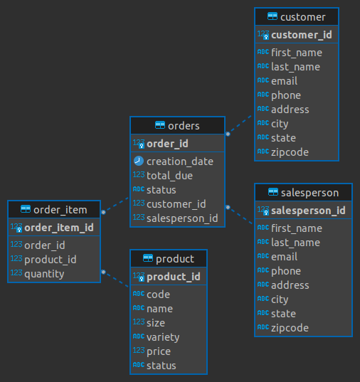

# Introduction
This is a Java Database Connectivity (JDBC) app, an application This is a Java Database Connectivity (JDBC) app, an application programming interface (API) built using Java and provides a service to access the database with create, read, update, and delete (CRUD) operations. This app is developed specifically to connect and exchange data with PostgreSQL (PSQL) database. IntelliJ combined with Maven was utilized to set up, develop and implement the application. Furthermore, docker was used for hosting a PSQL database to test the app's functionality and examine its interaction with the hosted database.   

# Implementaiton
## ER Diagram

## Design Patterns
The Data Access Object Pattern, aka DAO Pattern, is an abstraction of data persistence and has a table-centric way of presenting data by resembling its underlying database. Because DAO closely matches the tables from the database, it is much easier to exchange data from the database.

The Repository Pattern on the other hand is an abstraction of a collection of objects. Unlike DAO pattern which is structured very close to the database itself, the repository pattern sits at a much higher level and resembles the business logic of the app instead.

Therefore, both have different uses depending on the client of the application who will be interacting with it. For clients and users who have minimal technical knowledge, especially about databases, the repository pattern is favoured and for the others who have solid technical backgrounds, DAO pattern is preferred.

For this project, DAO pattern was used only to build two DAO classes: `Customer` and `Object`. One can interact database through CRUD operations from `CustomerDAO` class or `OrderDAO` class.

# Test
Initially, the PSQL database was hosted using docker. Then, the sample data were collected and inserted into the database.  Using the built app, we confirmed all CRUD operation was performed correctly and ensured any change to the database from the operation executed by the app was appropriate. Furthermore, the proper output from the app was verified by numerous usage and testing.

