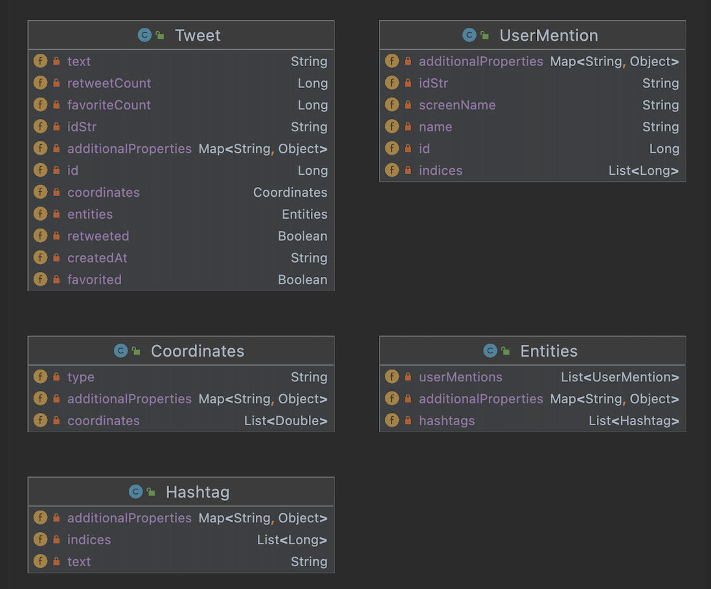

# Introduction
This is a Java application that interacts with Twitter REST API to perform create, read and delete (CRD) operations of a tweet of a designated Twitter account. The Twitter account used to perform the CRD operation is indicated by the keys and tokens of OAuth 1.0. Each operation involves sending an HTTP request using URI to the Twitter REST API and its response is received as a JSON object. The libraries utilized include Jackson and Mockito. Handling of all dependencies and structuring of the project was accomplished through the use of Maven. Finally, the project was deployed using Docker.

# Quick Start
### Generate Jar and run the application through Uber Jar file
<!--- how to package your app using mvn?-->
First, clone the app to your local machine. Then, set the environment variables for OAuth 1.0
- `consumerKey`: The consumer key or called API key
- `consumerSecret`: Consumer Secrete or called API secrete key
- `accessToken`: The access token for read and write access
- `tokenSecret`: The secret key for access token

Then, package your application through mvn:
```
mvn clean package
```
Above input to the terminal at the directory of the app will generate Uber Jar. Then, run the application through following command:

```
java -jar twitter-1.0-SNAPSHOT.jar post|show|delete [options]
```

<!--- how to run your app with docker?-->
### Running through Docker
Generate Jar file. Then run the following command:
```
docker build -t ${docker_user}/twitter .
```
This will generate the runnable docker container. Then run:
```
docker run --rm \
-e consumerKey=YOUR_VALUE \
-e consumerSecret=YOUR_VALUE \
-e accessToken=YOUR_VALUE \
-e tokenSecret=YOUR_VALUE \
<username>/twitter show|post|delete [options]
```

# Design
## UML diagram


#### App/Main

This component of the application interacts with a client directly. Summons the controller which is dependent on service which is dependent on on DAO objects. App/Main parses the command args received from a client and passes the parsed args to controller.

#### Controller

The controller layer summons the service component and interacts with it to perform its tasks. The controller layer recieves the parsed arguments and uses service layer to perform appropriate operation according to the arguments given.

#### Service

The service layer handles the business logic and calls DAO layer to perform it tasks. The service layer checks whether the commands inputted by a client is valid or not and uses DAO to operate appropriately.

#### DAO Component

DAO layer Interacts directly with Twitter REST API through HTTP requests. AO constructs appropriate URI to send HTTP requests to Twitter API. It is responsible for communication of data with Twitter server and performs create/show/delete tweets. 

## Models
In this project, the JSON objects that are delivered from the Twitter API have been represented through models in Java. Here is an example of a JSON tweet object:

```
//Simplified Tweet Object 
{
   "created_at":"Mon Feb 18 21:24:39 +0000 2018",
   "id":1097607323932564480,
   "id_str":"1097607323932564480",
   "text":"test with loc223",
   "entities":{
      "hashtags":[],      
      "user_mentions":[] 
   },
   "coordinates":null,    
   "retweet_count":0,
   "favorite_count":0,
   "favorited":false,
   "retweeted":false
}
```
To model a JSON object like above, following classes have been implemented



## Spring
The dependencies in spring are managed through Inversion of Control and Dependency injection. Inversion of Control is a principle in software engineering which transfers the control of objects or portions of a program to a container or framework. Dependency Injection is injecting the object that is dependent on the depending object. Spring uses annotation-based syntax to specify the specific role of each component and marks each component as Bean and sets up dependency accordingly. The annotation the spring uses include @Component, @Controller, @Service, and @Repository. The @Autowire annotation was used before each constructor to indicate to Spring that it must inject the dependencies through the constructor.

The application includes three different approaches to using Spring.
- The first approach is written in TwitterCLIBean class which is the manual construction of each bean and setting up dependencies manually.
- The second approach is written in TwitterCLIComponentScan where I set up the component annotation - @Component, @Controller, @Service, and @Repository and the spring will automatically set up the dependencies according to a built-in template from the spring framework
- The third approach is written in TwitterCLISpringBoot. It uses SpringBoot to manage dependencies. Simply writing @SpringBootApplication at the main/app component will configure the dependencies automatically. The only required is the source code where the beans are located - @SpringBootApplication(scanBasePackages = "ca.jrvs.apps.twitter") in this case.

Note that, the deployed version uses the last approach to run the application.

# Test
The frameworks used to test this application are Junit4 and Mockito. For each class, Integration tests and unit tests were written to test the functionality of multiple classes as a group and each class' methods

The integration testing was written for each class and it involved testing its functionality when interacting with other dependent class objects and the Twitter API itself. It made sure that there were no issues when performing cross-classes methods

The Unit testing tests the functionality of each method. It involved the use of mockito to mock other components to rule out its behaviour dependent on other classes. Mockito allowed testing each component in an isolated environment

# Deployment
The application was dockerized after deriving an uber jar using maven. Docker containerized the uber jar and I pushed the image to the Docker Hub repository. The docker containerization involved generating a DOCKERFILE and using openjdk:8-alpine as the base container where my application will be installed and run (note that openjdk:8-alpine is the bare minimum to run any Java 8 application.

The steps involved in dockerization and deployments are as follows:
```
# Build the uber jar
mvn clean package

# Create the image
docker built -t <username>/twitter .

# Push the image to the docker hub - deployment
docker push <username>/twitter
```

# Improvements
- Improved frontend, which is at the user-interface level could have been implemented. A convenient way to input environment variables, and show indication of invalid input would be much helpful to the users
- Option of the current location, instead of manually inputting the coordinates could be helpful to the user
- An additional feature of retrieving multiple tweets with ID (ex 20 recently posted tweets) would be helpful. That way, it would be easier for the user to zoom in on the specific tweet through the 'show' operation
