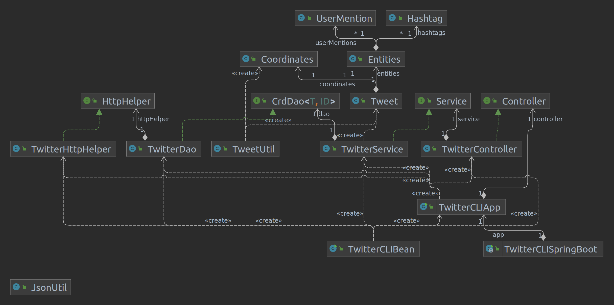

# Introduction
This is a Java application that interacts with Twitter REST API to perform create, read and delete (CRD) operations of a tweet of a designated Twitter account. The Twitter account used to perform the CRD operation is indicated by the keys and tokens of OAuth 1.0. Each operation involves sending an HTTP request using URI to the Twitter REST API and its response is received as a JSON object. The libraries utilized include Jackson and Mockito. Handling of all dependencies and structuring of the project was accomplished through the use of Maven. Finally, the project was deployed using Docker.

# Quick Start
### Generate Jar and run the application through Uber Jar file
<!--- how to package your app using mvn?-->
First, clone the app to your local machine. Then, set the environment variables for OAuth 1.0
- `consumerKey`: The consumer key or called API key
- `consumerSecret`: Consumer Secrete or called API secrete key
- `accessToken`: The access token for read and write access
- `tokenSecret`: The secret key for access token

Then, package your application through mvn:
```
mvn clean package
```
Above input to the terminal at the directory of the app will generate Uber Jar. Then, run the application through following command:

```
java -jar twitter-1.0-SNAPSHOT.jar post|show|delete [options]
```

<!--- how to run your app with docker?-->
### Running through Docker
Generate Jar file. Then run the following command:
```
docker build -t ${docker_user}/twitter .
```
This will generate the runnable docker container. Then run:
```
docker run --rm \
-e consumerKey=YOUR_VALUE \
-e consumerSecret=YOUR_VALUE \
-e accessToken=YOUR_VALUE \
-e tokenSecret=YOUR_VALUE \
<username>/twitter show|post|delete [options]
```

# Design
## UML diagram


## explain each component(app/main, controller, service, DAO) (30-50 words each)

## Models

Talk about tweet model
## Spring
- How you managed the dependencies using Spring?

# Test
How did you test you app using Junit and mockito?

# Deployment
How did you dockerize your app.

# Improvements
- Improved frontend, which is the at the user-interface level could have been implemented. Convenient way to input environment variable, and show indication of invalid input would be much helpful to the users 
- Option of current location, instead of manually inputting the coordinates could be helpful to the user 
- Additional feature of retrieving multiple tweets with ID (ex 20 tweets of last tweets) would be helpful. That way, it would be easier for the user to zoom in to the specific tweet through 'show' operation 
