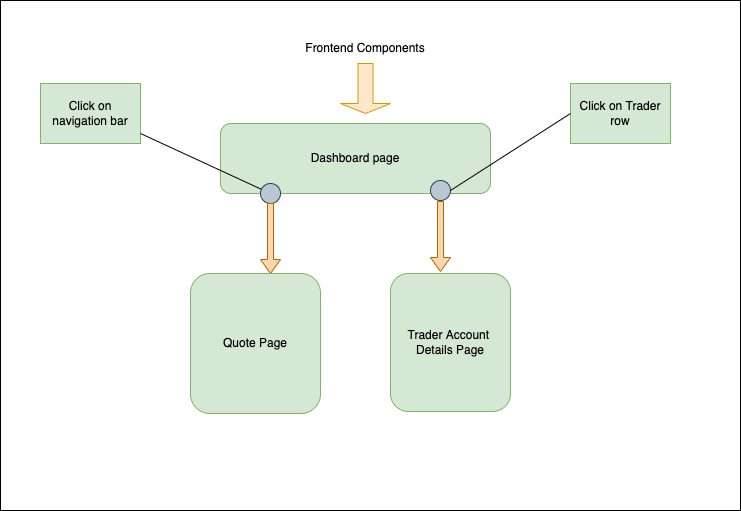

# Introduction
<!-- (about 150-200 words)
Discuss the design of the project. What does this project/product do? Who are the users? What are the technologies you have used? (e.g. npm, Reactjs) -->
This project was launched to place the user-friendly interface of the Stock Market API built using spring boot. Our team has decided to implement react application to build the frontend so all kinds of clients can use the API smoothly. `npm` - node package manager was used to set up the base of the application. The packages and dependencies required to build and run the application was assembled through `npm`. These packages and dependencies are listed in the `package.json` file. The `npm` will store these packages and dependencies in `node_modules/` folder. 

This application is composed of two different pages - the dashboard and the quote page. The dashboard page will list out a list of traders of the trading centre. The quoted page will list out the daily list of tickers available to trade. The application can add new a trader, or delete a trader. Also, for each trader, there will be his/her account page and the user will be able to deposit or withdraw funds. 

# Quick Start
Make sure docker is installed. First, pull the docker images for the backend.
```
docker pull johnphk/trading-psql
docker pull johnphk/trading-app
```
Then, run the SQL database image as a container.
```
docker run --name trading-psql-dev \
-e POSTGRES_PASSWORD=password \
-e POSTGRES_DB=jrvstrading \
-e POSTGRES_USER=postgres \
--network trading-net \
-d -p 5432:5432 trading-psql
```
And, run the trading-app image as a container.
```
docker run --name trading-app-dev \
-e "PSQL_URL=jdbc:postgresql://trading-psql-dev:5432/jrvstrading" \
-e "PSQL_USER=postgres" \
-e "PSQL_PASSWORD=password" \
-e "IEX_PUB_TOKEN=${IEX_PUB_TOKEN}" \
--network trading-net \
-p 8080:8080 -t trading-app
```
Then, make sure node and `npm` is installed on your machine.
change the directory to `trading-ui/`
```
cd {wherever trading-ui is placed}/trading-ui/
```
Then, start application
```
npm start
```

# Implementation
The application is built using react to have a single page website for faster and better user experience. The application is page is broken down into components: 
    - `Navbar`: Navigation bar
    - `QuoteList`: List of Quotes
    - `TraderList`: List of Traders
There is three pages, `Dashbard` page, `Quote` page, and `TraderAccount` page. When `Dashboard` page is called `Navbar`and `TraderList` components are used. When `Quote` page is called `Navbar` and `QuoteList`components are used. Lastly for the `TraderAccount` page, it uses `Navbar` and its own elements to establish itself. 

## Architecture


# Test
Test was done through manual testing. Manual integration and regression testing was done by the testing team.

# Deployment
The application is deployed using both Github and Docker. 

# Improvements
- Quote adding and removing 
- Having separate administrator and regular user view
- Ability trade through this application would be better