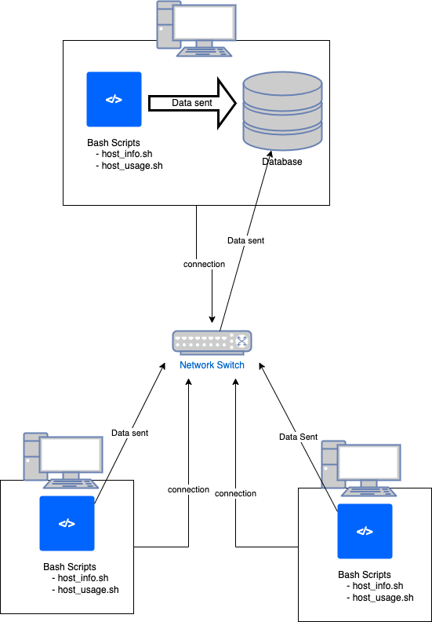

# Linux Cluster Monitoring Agent
This project is under development. Since this project follows the GitFlow, the final work will be merged to the master branch after Team Code Team.

# Introduction
A Linux cluster is a connected array of Linux computers or nodes that operate together to function as a single system. Each of the nodes or computers is connected through a local area network. For the sake of managing multiple machines, each machine needs to share information and record the shared information in a database.

This project aims to build an automated software that can record the hardware specification of each node and monitor its resource usage of them. The software will store the retrieved data from each node in an RDBMS database. This software will help the users of a Linux cluster analyze the hardware usages of different nodes and plan to allocate the resource in an economical manner. 


# Quick Start
First navigate to root directory of this project. The root directory of this project is `linux_sql` directory

- Start a psql instance using psql_docker.sh

```
bash ./scripts/psql_docker.sh create [username] [password]

# [side] To start or stop the psql instance docker
bash ./scripts/psql_docker.sh [start|stop] jrvs-psql 
``` 

- Create tables using ddl.sql
```

```

- Insert hardware specs data into the DB using host_info.sh
```

```

- Insert hardware usage data into the DB using host_usage.sh
```

```

- Crontab setup
```

```

# Implemenation
Discuss how you implement the project.

## Architecture
Diagram showing overall architecture and design of LCA project.
<p align="center">
    
</p>


## Scripts
Shell script description and usage (use markdown code block for script usage)
- psql_docker.sh
- host_info.sh
- host_usage.sh
- crontab
- queries.sql (describe what business problem you are trying to resolve)

## Database Modeling
Describe the schema of each table using markdown table syntax (do not put any sql code)
- `host_info`
- `host_usage`

# Test
How did you test your bash scripts and SQL queries? What was the result?

# Deployment
How did you deploy your app? (e.g. Github, crontab, docker)

# Improvements
Write at least three things you want to improve 
e.g. 
- handle hardware update 
- blah
- blah
