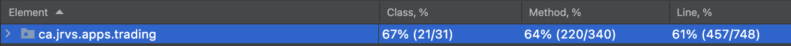

Table of contents
* [Introduction](#Introduction)
* [Quick Start](#Quick-Start)
* [Implementation](#Implemenation)
* [Test](#Test)
* [Deployment](#deployment)
* [Improvements](#improvements)

# Introduction  <a name="Introduction"></a>
This project was kicked off to replace the trading platform built using monolithic architecture. Applications built using monolithic architecture is diffcult to manage and scale when more features are added and grows in size. This application is a REST API that is built based on microservice architecture. It is able to retrieve information about particular stock(s) and make a stock trade. The application also manages clients by generating trader acounts. The generated accounts hold records of stocks bought/sold by the corresponding trader and contains amount of funds the trader have to perform trade. The application is built using Java with a postgres database. Springboot was used to manage the dependency and Apache tomcat was used to host the application as a server. In terms of testing, JUnit4 and Mockito was used to test its performance and integration. Finally, the Uber Jar file of the application and the configured database is dockerized as two corresponding images. The dockerized images are hosted on docker hub. 

# Quick Start 
For quick start, ensure docker version 17.05 or higher is installed on your machine. One can check by,
```
docker -v
``` 
Also, obtain a personlized iex_token by signing up to https://iexcloud.io/. The information about stocks are updated through this application. 

Build Docker images for the postgres sql after changing the current directory to `psql/`
```
cd ./psql  
docker build -t trading-psql .    
docker image ls -f reference=trading-psql    #check image 
```
Then, change the current directory to the project's base directory. then, build docker image for the application
```
cd ..
docker build -t trading-app .
docker image ls -f reference=trading-psql
```
To run the containers, there must be docker network to be used. Run the following command to establish a trading-network
```
docker network create --driver bridge trading-net
```
Then, the application can start by running following commands on bash
```
# Run our Postgres database container
docker run -d --name trading-psql \
-e POSTGRES_USER=$PSQL_USER \
-e POSTGRES_PASSWORD=$PSQL_PASSWORD \
-v pgdata:$PGDATA_PATH \
--network trading-net -p 5432:5432 trading-psql

# Run our trading app container
docker run -d --name trading-app-dev \
-e "PSQL_HOST=trading-psql" \
-e "PSQL_PORT=5432" \
-e "PSQL_DB=jrvstrading" \
-e "PSQL_USER=$PSQL_USER" \
-e "PSQL_PASSWORD=$PSQL_PASSWORD" \
-e "IEX_PUB_TOKEN=$IEX_PUB_TOKEN" \
--network trading-net \
-p 8080:8080 -t trading-app
```
The following picture contains example of how the application looks like on swagger-ui when it is ran. Once docker container is ran, application can be seen through a browser on `localhost:8080`


# Implementation <a name="Implementation"></a>
## Architecture


The components in green backgrounds are components of the trading application. The components in the light blue background is the components in the database.

Our application is composed of layers - controller layer, service layer and data access layer. The controllers are what handles the request using the service layers. The service layers handles the business logic of the application. The data access layer is composed of Data Access Objects that interacts with JDBC and converts database resource into a java objects that can be handled and manipulated in java program. 

As one can see, QuoteDao is reponsible for accessing and managing the data from the quote table. It then passes the parsed resource to the QuoteService. TraderDao and AccountDao is responsible for accessing and managing the data from account and trader table respectively. The parsed data from the database are passed on to service components to continue their processing. The same goes for ServiceDao and PositionDao. 

Below, MarketDataDao updates the stocks using data obtained from IEX cloud. This is obtained through HTTP client module. 

 We used Tomcat for webservlet. It functions as an interface between the application and the client. When a client sends a HTTP request to the application, it arrives at the Webservlet. The servlet filters out certain requests and for ones appropriate, it commands controller layers to carry out its work to generate corresponding response.
<!-- 
- Draw a component diagram that contains controllers, services, DAOs, SQL, IEX Cloud, WebServlet/Tomcat, HTTP client, and SpringBoot. (you must create your own diagram)
- briefly explain the following components and services (3-5 sentences for each)
  - Controller layer (e.g. handles user requests....)
  - Service layer
  - DAO layer
  - SpringBoot: webservlet/TomCat and IoC
  - PSQL and IEX -->
## REST API Usage 
### Swagger
The swagger is an application that allows users to use a REST API in a convenient way. It lays out all the possible urls and http methods it can take. It also lists out all the model objects which are representation of resources that are persisted in database. 
<!-- 
What's swagger (1-2 sentences, you can copy from swagger docs). Why are we using it or who will benefit from it? -->
### Quote Controller
- Quote Controller manages and updates quotes. The source of information about updated quotes is IEX Cloud API. When the request of update is received, Quote Controller will command its service component to retrieve information from IEX Cloud API and persist the updated information to Postgres Database. 
  - GET `/quote/dailyList`: list all securities that are available to trading in this trading system
  - GET `/quote/iex/ticker/{ticker}`: retrieves IexQuote from the IEX Cloud API
  - POST `/quote/tickerId/{tickerId}`: creates a new quote with specific ticker id and persist in database
  - PUT `/quote/`: updates a specifc quote
  - PUT `/quote/iexMarketData`: updates current quotes in database by parsing iexQuotes obtained from IEX Cloud API

### Trader Account Controller
- Manages traders and accounts. It allows traders to deposit or withdraw funds from their accounts. It keeps record of funds and trade history in the database
- briefly explain each endpoint 
  - DELETE `/trader/traderId/{traderId}`: Deletes a trade with id `traderId`
  - POST `/trader/`: Creates a new trader - based on information available in body
  - POST `/trader/firstname/{firstname}/lastname/{lastname}/dob/{dob}/country/{country}/email/{email}`: Creates a new trader by parsing the url
  - PUT `/trader/deposit/traderId/{traderId}/amount/{amount}`: Deposits a fund to the trader with id `traderId` with amount `amount`
  - PUT `/trader/withdraw/traderId/{traderId}/amount/{amount}`: Withdraws a fund from the trader with id `traderId` with amount `amount`

### Order Controller
- Manages all the orders executed by the system. It allows to make an order and able to retrieve information about it
  - POST `/order/marketOrder` : Make a new order

### Dashboard controller
- Manages the profile and portfolio view about a trader. 
  - GET `/dashboard/portfolio/traderId/{traderId}`: retrieves portfolio view of trader with id `traderId`
  - GET `/dashboard/profile/traderId/{traderId}`: retrieves profile view of a trader with id `traderId`


# Test <a name="Test"></a>
Integration tests each component was performed using JUnit4. Mockito was used in places necessary to test specific unit of a component. For the tests, the line coverage of above 60% was maintained for each component


# Deployment <a name="Deployment"></a>
The application was deployed using docker. There is two docker images generated for the Postgres database and the trading application itself. 

The image of Postgres database was generated from the base image `postgres:9.6-alpine`. We let two SQL scripts to be run from the base image to establish the database - `jrvstrading` - and establish tables - `Quote`, `Trader`, `SecurityOrder`, `Account`, `Position`.

The trading application was built by moving the source code to the ` maven:3.6-jdk-8-slim` image for packaging the code into a Uber Jar file. Then, the Uber Jar file was uploaded to `openjdk:8-alpine` to accomplish the container development.


# Improvements <a name="Improvements"></a>
- Front end of the application would be a great way to perfect the application
- The trade is not possible outside of 9:30am - 4pm. Make an order outside of those hours with pending status
- Automate the whole process of running database and the trading application, instead of running each one of them separately
