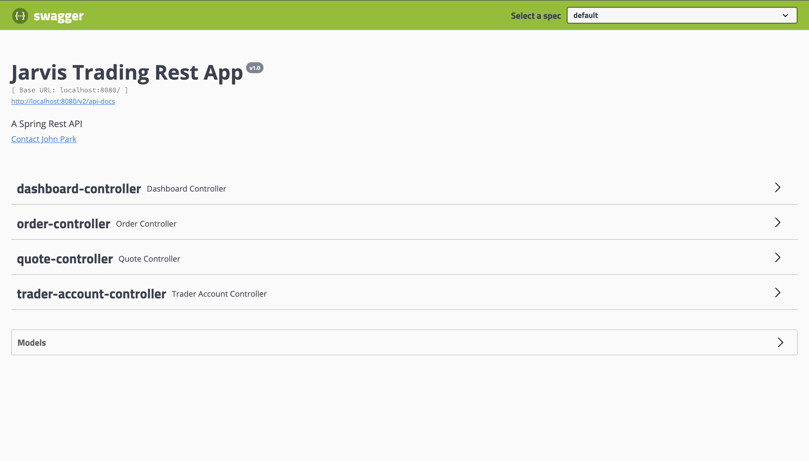
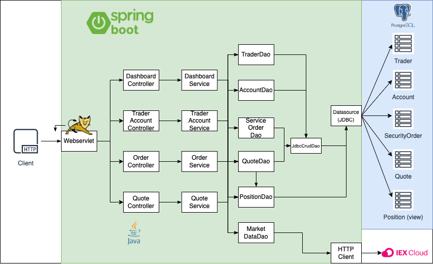

Table of contents
* [Introduction](#Introduction)
* [Quick Start](#Quick-Start)
* [Implementation](#Implemenation)
* [Test](#Test)
* [Deployment](#deployment)
* [Improvements](#improvements)

# Introduction  <a name="Introduction"></a>
This project was kicked off to replace the trading platform built using monolithic architecture. Applications built using monolithic architecture is diffcult to manage and scale when more features are added and grows in size. This application is a REST API that is built based on microservice architecture. It is able to retrieve information about particular stock(s) and make a stock trade. The application also manages clients by generating trader acounts. The generated accounts hold records of stocks bought/sold by the corresponding trader and contains amount of funds the trader have to perform trade. The application is built using Java with a postgres database. Springboot was used to manage the dependency and Apache tomcat was used to host the application as a server. In terms of testing, JUnit4 and Mockito was used to test its performance and integration. Finally, the Uber Jar file of the application and the configured database is dockerized as two corresponding images. The dockerized images are hosted on docker hub. 

# Quick Start 
For quick start, ensure docker version 17.05 or higher is installed on your machine. One can check by,
```
docker -v
``` 
Also, obtain a personlized iex_token by signing up to https://iexcloud.io/. The information about stocks are updated through this application. 

Build Docker images for the postgres sql after changing the current directory to `psql/`
```
cd ./psql  
docker build -t trading-psql .    
docker image ls -f reference=trading-psql    #check image 
```
Then, change the current directory to the project's base directory. then, build docker image for the application
```
cd ..
docker build -t trading-app .
docker image ls -f reference=trading-psql
```
To run the containers, there must be docker network to be used. Run the following command to establish a trading-network
```
docker network create --driver bridge trading-net
```
Then, the application can start by running following commands on bash
```
# Run our Postgres database container
docker run -d --name trading-psql \
-e POSTGRES_USER=$PSQL_USER \
-e POSTGRES_PASSWORD=$PSQL_PASSWORD \
-v pgdata:$PGDATA_PATH \
--network trading-net -p 5432:5432 trading-psql

# Run our trading app container
docker run -d --name trading-app-dev \
-e "PSQL_HOST=trading-psql" \
-e "PSQL_PORT=5432" \
-e "PSQL_DB=jrvstrading" \
-e "PSQL_USER=$PSQL_USER" \
-e "PSQL_PASSWORD=$PSQL_PASSWORD" \
-e "IEX_PUB_TOKEN=$IEX_PUB_TOKEN" \
--network trading-net \
-p 8080:8080 -t trading-app
```
The following picture contains example of how the application looks like on swagger-ui when it is ran. Once docker container is ran, application can be seen through a browser on `localhost:8080`



# Implementation <a name="Implementation"></a>
## Architecture


The components in green backgrounds are components of the trading application. The components in the light blue background is the components in the database.

Our application is composed of layers - controller layer, service layer and data access layer. The controllers are what handles the request using the service layers. The service layers handles the business logic of the application. The data access layer is composed of Data Access Objects that interacts with JDBC and converts database resource into a java objects that can be handled and manipulated in java program. 

Below, MarketDataDao updates the stocks using data obtained from IEX cloud. This is obtained through HTTP client module. 

 We used Tomcat for webservlet. It functions as an interface between the application and the client. When a client sends a HTTP request to the application, it arrives at the Webservlet. The servlet filters out certain requests and for ones appropriate, it commands controller layers to carry out its work to generate corresponding response.

- Draw a component diagram that contains controllers, services, DAOs, SQL, IEX Cloud, WebServlet/Tomcat, HTTP client, and SpringBoot. (you must create your own diagram)
- briefly explain the following components and services (3-5 sentences for each)
  - Controller layer (e.g. handles user requests....)
  - Service layer
  - DAO layer
  - SpringBoot: webservlet/TomCat and IoC
  - PSQL and IEX
## REST API Usage 
### Swagger
What's swagger (1-2 sentences, you can copy from swagger docs). Why are we using it or who will benefit from it?
### Quote Controller
- High-level description for this controller. Where is market data coming from (IEX) and how did you cache the quote data (PSQL). Briefly talk about data from within your app
- briefly explain each endpoint
  e.g.
  - GET `/quote/dailyList`: list all securities that are available to trading in this trading system blah..blah..
### Trader Controller
- High-level description for trader controller (e.g. it can manage trader and account information. it can deposit and withdraw fund from a given account)
- briefly explain each endpoint
### Order Controller
- High-level description for this controller.
- briefly explain each endpoint
### App controller
- briefly explain each endpoint
### Optional(Dashboard controller)
- High-level description for this controller.
- briefly explain each endpoint

# Test <a name="Test"></a>
How did you test your application? Did you use any testing libraries? What's the code coverage?

# Deployment <a name="Deployment"></a>
- docker diagram including images, containers, network, and docker hub
e.g. https://www.notion.so/jarviscanada/Dockerize-Trading-App-fc8c8f4167ad46089099fd0d31e3855d#6f8912f9438e4e61b91fe57f8ef896e0
- describe each image in details (e.g. how psql initialize tables)

# Improvements <a name="Improvements"></a>
If you have more time, what would you improve?
- at least 3 improvements
